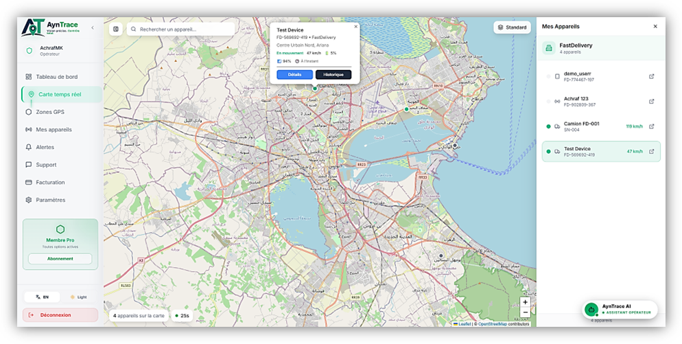
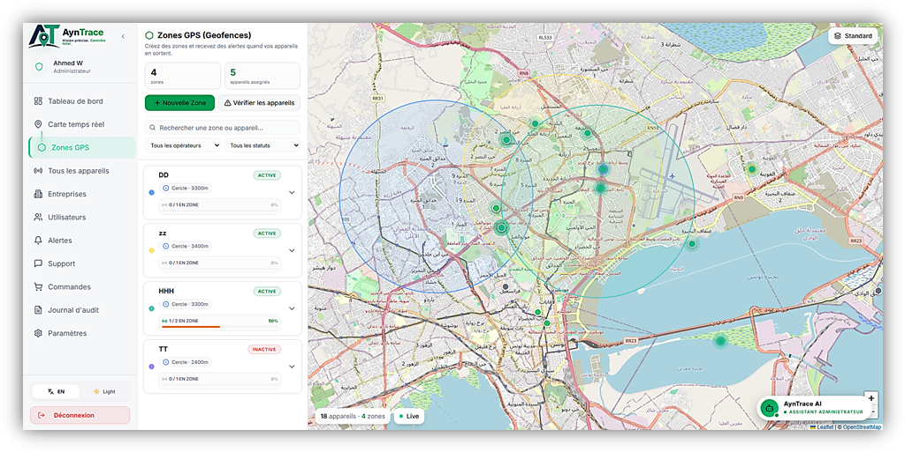
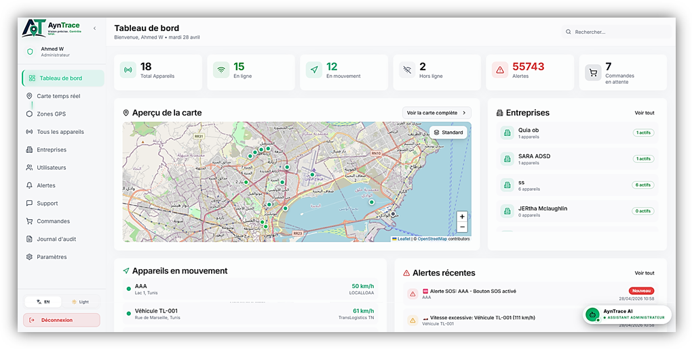
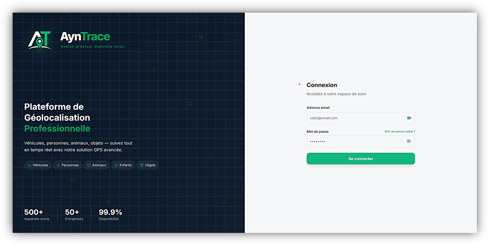
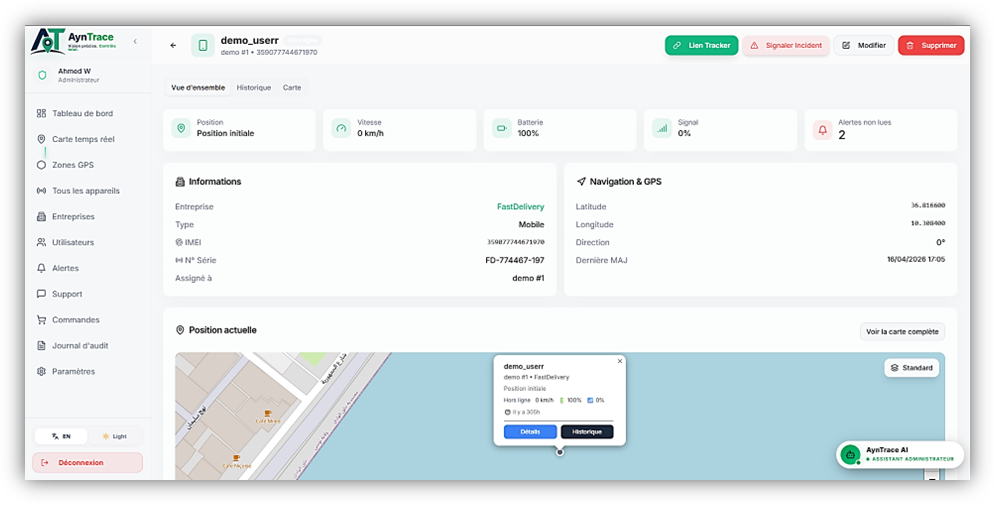
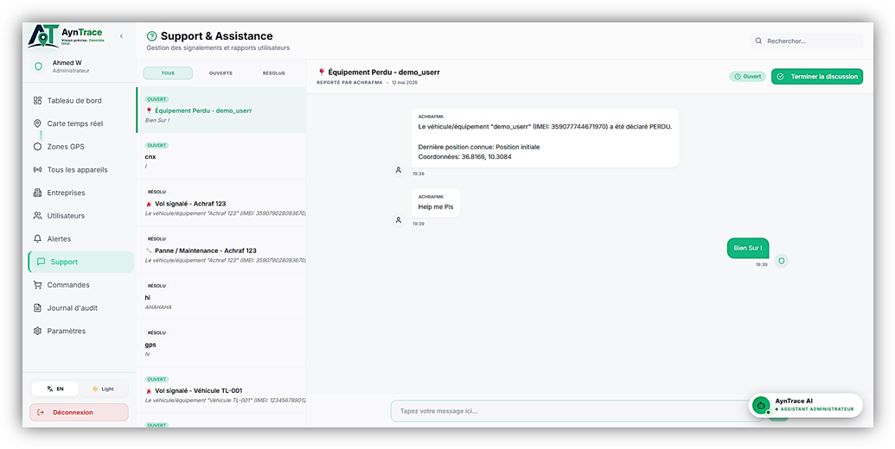
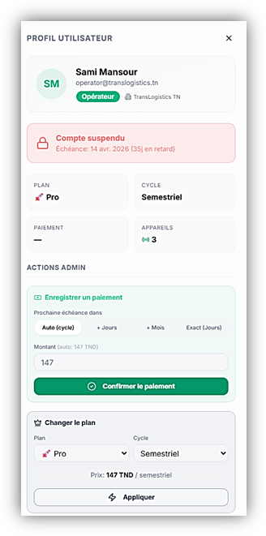

# AynTrace

GPS tracking and fleet management platform. PFE academic project.

---

## 📸 Platform Screenshots

<div align="center">
  
  <br/><br/>
  
  <br/><br/>
  
  
  <br/><br/>
  
  
  <br/><br/>
  
</div>

---

## 🚀 Option 1: Run with Docker (Easiest — No PostgreSQL installation needed)

Requires **Docker Desktop**. The database, backend, and frontend start automatically with demo data.

```bash
# 1. Clone the repository
git clone https://github.com/Achraflgu/AynTrace.git
cd AynTrace

# 2. Start all services
docker compose up --build
```

- **Application UI:** http://localhost
- **Backend API:** http://localhost/api
- **Health check:** http://localhost/api/health

---

## 💻 Option 2: Run Locally (Node.js + Local PostgreSQL)

**Prerequisites:** Node.js 20+ and PostgreSQL 14+ installed and running locally.

```bash
# 1. Clone the repository
git clone https://github.com/Achraflgu/AynTrace.git
cd AynTrace

# 2. Install dependencies (Root + Server)
npm install
cd server && npm install && cd ..

# 3. Set up environment file
cp server/.env.example server/.env
# Edit server/.env if your local PostgreSQL user/password differ

# 4. Create database, tables, and demo data automatically
npm run db:setup

# 5. Start frontend & backend together
npm run dev:all
```

- **Frontend:** http://localhost:8080
- **Backend API:** http://localhost:3001

---

## 🔑 Demo Accounts

| Role       | Email                          | Password          |
|------------|--------------------------------|-------------------|
| Admin      | `ach45gu14@gmail.com`          | `PFE-Admin-6B2794` |
| Operator   | `achrafguemati557@gmail.com`   | `PFE-Oper-8C15B7`  |
| Supervisor | `supervisor@ayntrace.tn`       | `PFE-Super-C20650` |

---

## 📁 Project Structure

```
src/              React frontend (Vite + TypeScript + Tailwind CSS)
server/           Express backend (Node.js + Knex + PostgreSQL)
server/routes/    API routes
server/db/        Database migrations and seed scripts
server/simulation/GPS simulation engine
tracker-page/     External GPS tracker page
cypress/          E2E tests
```

---

## 🛠️ Available Commands

| Command              | Description                        |
|----------------------|------------------------------------|
| `npm run dev:all`    | Start frontend + backend together  |
| `npm run db:setup`   | Create database + tables + demo data |
| `npm run build`      | Build frontend for production      |
| `npm run dev`        | Start frontend only                |
| `npm run db:migrate` | Create database tables only        |
| `npm run db:seed`    | Seed demo data only                |

---

## ⚡ Technologies

**Frontend:** React, TypeScript, Vite, Tailwind CSS, Leaflet, shadcn/ui, Zustand, React Query

**Backend:** Node.js, Express, Knex, PostgreSQL, WebSocket, JWT
